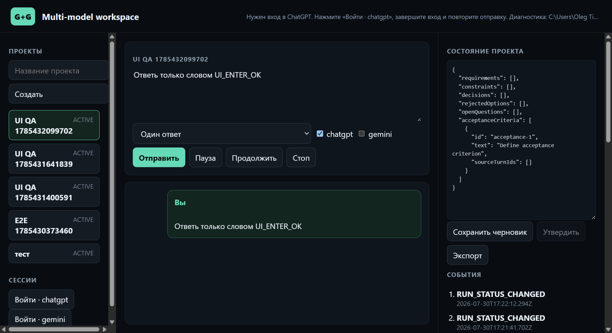
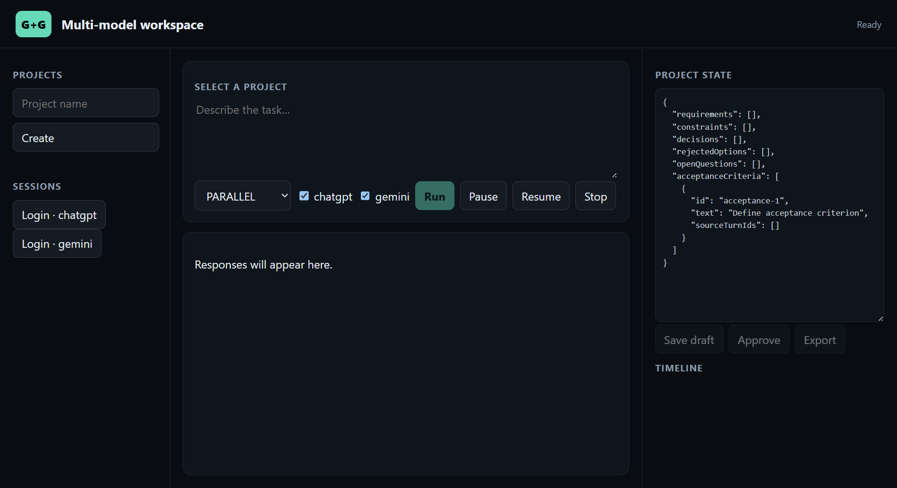
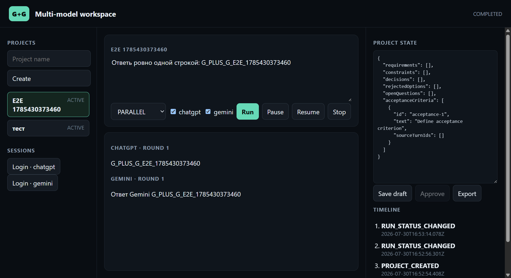
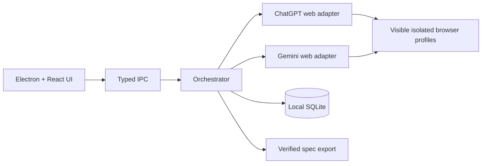

# G plus G

> **Статус: Beta — активная разработка.** Интерфейсы и адаптеры веб-провайдеров могут меняться между релизами.

[](https://github.com/Nturalintelligence/G-plus-G/actions/workflows/ci.yml)
[](LICENSE)

Локальное desktop-приложение для управляемого совместного обсуждения задач через
ChatGPT Web и Gemini Web. Проекты, история, требования и решения остаются на
компьютере пользователя; веб-интерфейсы провайдеров используются через видимый
браузер и изолированные профили.

В приложение входят ограниченная multi-model оркестрация, SQLite, визуальный
конструктор спецификации с привязкой к ответам моделей, проверяемый экспорт,
резервные копии, диагностика и Electron UI.
Локальный Центр качества показывает успешность, задержки и повторные попытки
отдельно для ChatGPT и Gemini, не сохраняя содержимое сообщений.

## Интерфейс



| Параллельный запуск | Результаты ChatGPT и Gemini |
| --- | --- |
|  |  |

Короткая видеодемонстрация будет добавлена к ближайшему GitHub Release.

## Architecture



Проекты, история и диагностика хранятся локально. Адаптеры работают через видимые браузерные сессии пользователя; приложение не требует передачи cookies или токенов стороннему backend.

## Установка и запуск

```powershell
npm install
npx playwright install chromium
npm run login
npm run send -- --message "Ответь одним словом: тест"
npm run verify -- --count 20
npm start -- login --provider gemini
npm start -- send --provider gemini --message "Ответь одним словом: тест"
npm run desktop:start
```

`login` открывает видимый Chromium и ждёт ручной авторизации. Окно не закрывается,
пока на странице видны кнопки входа/регистрации; наличие анонимного поля ввода не
считается авторизацией. Сессия сохраняется в общей папке данных приложения и
используется при следующих запусках.

## Как определяется ответ

Перед отправкой сохраняется снимок всех найденных ответов ассистента: DOM id,
порядковый номер, нормализованный текст и SHA-256. После подтверждения появления
конкретного пользовательского сообщения принимается только один новый узел,
которого не было в снимке. Изменение старого «последнего блока» ответом не считается.
При неоднозначности прототип останавливается.

Ответ считается завершённым, когда исчезла кнопка остановки генерации и текст
нового узла стабилен не менее 2,5 секунды. CAPTCHA и страницы проверки приводят к
немедленной остановке без попытки обхода.

## Проверка этапа

```powershell
npm run check
npm run verify -- --count 20
```

Автоматические тесты проверяют логику привязки ответа. Команда `verify` выполняет
реальный последовательный прогон, используя уникальный маркер в каждом запросе.
После успешного прогона закройте приложение и повторите `send`, чтобы вручную
подтвердить сохранение авторизации.

Изменение DOM ChatGPT может потребовать обновления селекторов. При ошибке JSON-отчёт
с безопасной диагностикой создаётся в `%APPDATA%\multi-llm-orchestrator-feasibility\logs`
на Windows. Там же находится `application.jsonl`. Cookies, токены и содержимое
профиля в отчёты не попадают.

## Этап 1: локальные проекты

```powershell
npm start -- project:create --name "Мой проект"
npm start -- project:list
npm start -- project:open --id "prj_..."
```

SQLite хранится в общей папке данных приложения как `orchestrator.sqlite`. При первом обращении
миграции применяются автоматически. База использует WAL, внешние ключи и полные
синхронные записи. События защищены SQL-триггерами от изменения и удаления.
При открытии проекта незавершённые ходы и попытки атомарно переводятся в
`INTERRUPTED`, а факт восстановления добавляется в event log.

Текущая готовность этапов и известные ограничения описаны в
[`docs/implementation-status.md`](docs/implementation-status.md).

## Предрелизная проверка и резервные копии

Перед ручным тестированием проверьте среду:

```powershell
npm run preflight
npm run release:info
```

`preflight` проверяет версию Node.js, доступность Playwright/браузера и возможность
записи в каталог данных. `release:info` печатает версию приложения, Git-коммит,
платформу и фактический каталог данных — этот отчёт полезно прикладывать к баг-репорту.

Создание и проверка резервной копии:

```powershell
npm run backup -- --file "$env:USERPROFILE\Documents\G-plus-G backups"
npm run backup:validate -- --file "C:\...\g-plus-g-backup-..."
```

Копия создаётся как каталог с отметкой времени. SQLite снимается через
`VACUUM INTO`, поэтому в копию попадают зафиксированные данные из WAL. Manifest
содержит SHA-256 и результат `PRAGMA quick_check`. Содержимое browser-профилей,
cookies, токены и тексты логов не копируются. Настройки, если они есть, проходят
рекурсивное маскирование чувствительных ключей.

Восстановление требует закрытого desktop-приложения:

```powershell
npm run restore -- --file "C:\...\g-plus-g-backup-..."
```

Перед заменой выполняются проверка manifest, контрольной суммы и целостности
SQLite. Предыдущая база сохраняется рядом как `orchestrator.sqlite.before-restore`.

Те же безопасные операции доступны в desktop-приложении в разделе
«Профиль и настройки → Диагностика и данные». Там можно проверить окружение,
создать резервную копию, открыть фактическую папку данных и сбросить отдельную
браузерную сессию. Сброс сессии требует подтверждения и не удаляет проекты.
