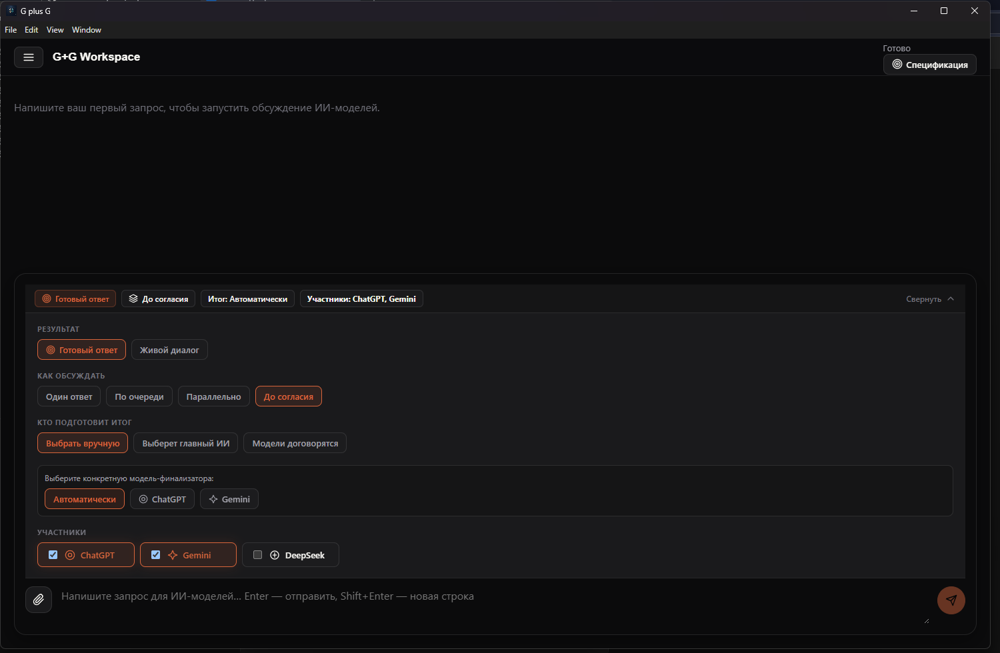
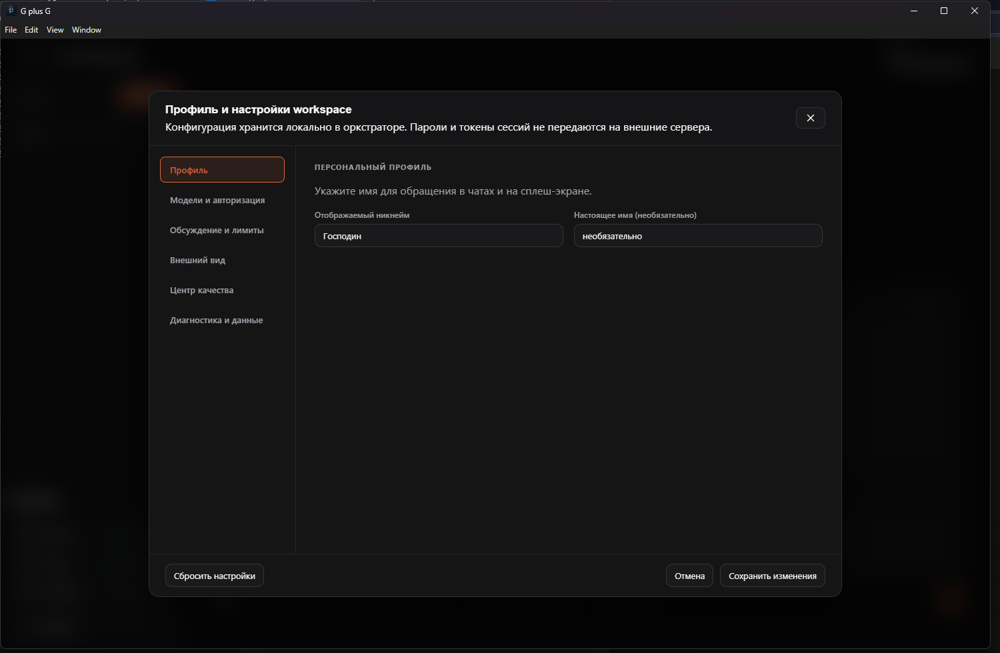
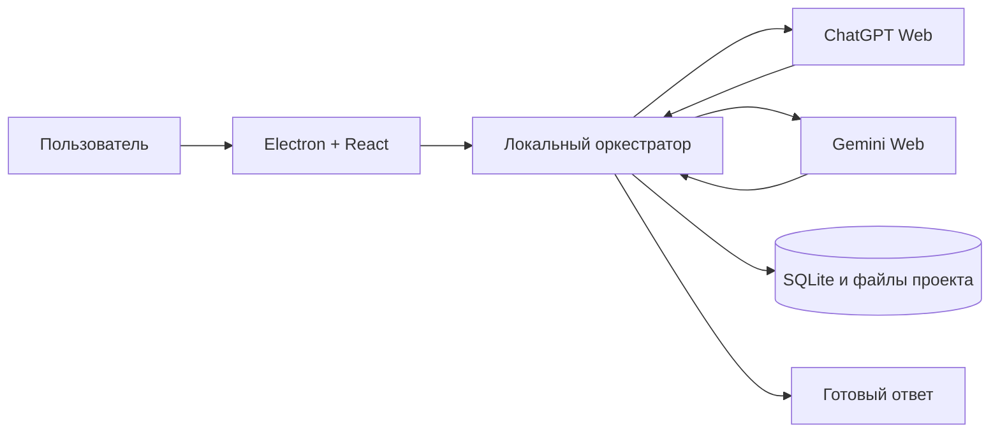

# G+G

> Локальное desktop-приложение, в котором ChatGPT и Gemini совместно обсуждают задачу и формируют единый результат.

[](https://github.com/Nturalintelligence/G-plus-G/releases)
[](https://github.com/Nturalintelligence/G-plus-G/actions/workflows/ci.yml)
[](LICENSE)

G+G помогает работать с несколькими ИИ в одном проекте. Пользователь задаёт вопрос один раз, приложение передаёт его выбранным моделям, сохраняет ход обсуждения и показывает итоговый ответ отдельно от внутренней дискуссии.

Данные проектов хранятся локально. Для ChatGPT и Gemini используются отдельные видимые браузерные профили: пользователь входит в аккаунты самостоятельно, а пароли, cookies и токены не отправляются на сторонний сервер G+G.

## Как выглядит приложение


| Обсуждение моделей | Настройки и состояние провайдеров |
| --- | --- |
|  |  |

## Что умеет версия 0.0.1

- создавать локальные проекты и хранить историю в SQLite;
- работать с ChatGPT Web и Gemini Web через раздельные браузерные сессии;
- запускать один ответ, последовательное обсуждение, параллельную работу и ограниченный режим дебатов;
- показывать готовый ответ отдельно от промежуточных реплик моделей;
- сохранять требования, ограничения, решения и критерии приёмки проекта;
- прикреплять TXT, Markdown, PDF, PNG и JPEG в управляемое локальное хранилище;
- создавать резервные копии без browser-профилей и учётных данных;
- показывать локальные метрики успешности, задержек и повторов;
- останавливать выполнение и восстанавливать незавершённые операции после перезапуска.

## Быстрый запуск из исходного кода

Требуются Windows, Node.js 20+ и npm.

```powershell
git clone https://github.com/Nturalintelligence/G-plus-G.git
cd G-plus-G
npm install
npx playwright install chromium
npm run desktop:start
```

После запуска откройте настройки, выберите ChatGPT или Gemini и выполните обычный ручной вход в появившемся браузере. G+G сохраняет сессии отдельно для каждого провайдера.

## Принцип работы



Renderer не получает прямой доступ к Node.js или shell. Вызовы проходят через ограниченный preload/IPC-слой. Тексты моделей, вложения и ссылки считаются недоверенными данными. Подробнее: [модель безопасности](docs/SECURITY_MODEL.md) и [архитектура](docs/architecture.md).

## Приватность

- проекты и история остаются на компьютере пользователя;
- ChatGPT и Gemini используют независимые browser-профили;
- резервные копии не включают cookies, токены и browser-профили;
- логи маскируют чувствительные поля;
- приложение не обходит CAPTCHA и ограничения провайдеров.

## Ограничения раннего релиза

- интерфейсы сайтов ChatGPT и Gemini могут меняться и требовать обновления адаптеров;
- первая авторизация выполняется вручную;
- DeepSeek и остальные модели в интерфейсе пока являются экспериментальными и не имеют готового web-адаптера;
- выполнение кода без CLI пока не входит в стабильный релиз;
- установщик Windows ещё не подписан коммерческим сертификатом.

## Проверка проекта

```powershell
npm run security:guard
npm run desktop:typecheck
npm run check
```

Тяжёлые браузерные проверки требуют пользовательских аккаунтов и запускаются отдельно от обычного CI.

## Документация

- [текущая матрица функций](docs/FEATURE_MATRIX.md);
- [архитектура](docs/architecture.md);
- [модель безопасности](docs/SECURITY_MODEL.md);
- [известные ограничения](docs/KNOWN_ISSUES.md);
- [сценарий ручной приёмки](docs/UAT_RUNBOOK.md).

## Лицензия

[MIT](LICENSE). Проект не является официальным продуктом OpenAI или Google и не связан с ними юридически.
